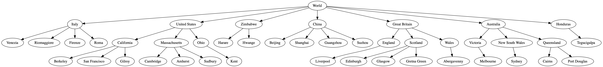

# World Tree
Implementation and traversal demo of a tree via functional programming

### Overview

The `world-tree` function in *world-tree.rkt* simply constructs a tree based on this graph: 

To run the demo, simply enter `racket world-tree.rkt` within the project directory.
